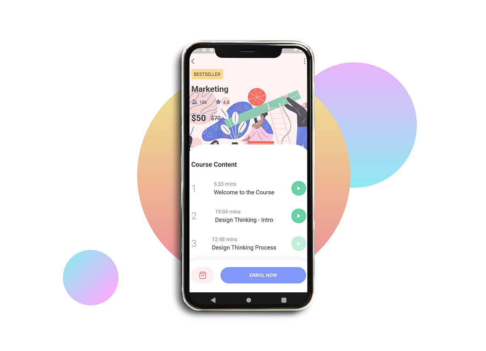

# LEARNFIC :books:
Flutter Online Learning Mobile App

Online learning is both a convenience and a challenge. It gives you a great deal of flexibility. Get your e-learning app developed with a sense of innovation in it. If you are planning to build an online course mobile app, then LEarnfic will be an awesome UI solution for your next Flutuer base Online course mobile app.

The source code is **100% Dart**, and everything resides in the [/lib](https://github.com/shameemreza/learnfic/tree/master/lib) folder.

[](https://opensource.org/licenses/Apache-2.0)
[](https://github.com/shameemreza/learnfic/blob/master/licence.txt)

# Screenshots



# Credits:

- Design: [SimantOo](https://dribbble.com/shots/10847143-Course-App-Free)
- Illustrations: [Brad Cuzen](https://dribbble.com/bradcuzen)

## License

```
Copyright 2020 Shameem Reza

Licensed under the Apache License, Version 2.0 (the "License");
you may not use this file except in compliance with the License.
You may obtain a copy of the License at

   http://www.apache.org/licenses/LICENSE-2.0

Unless required by applicable law or agreed to in writing, software
distributed under the License is distributed on an "AS IS" BASIS,
WITHOUT WARRANTIES OR CONDITIONS OF ANY KIND, either express or implied.
See the License for the specific language governing permissions and
limitations under the License.

## Getting Started

For help getting started with Flutter, view our online
[documentation](https://flutter.io/).
```
